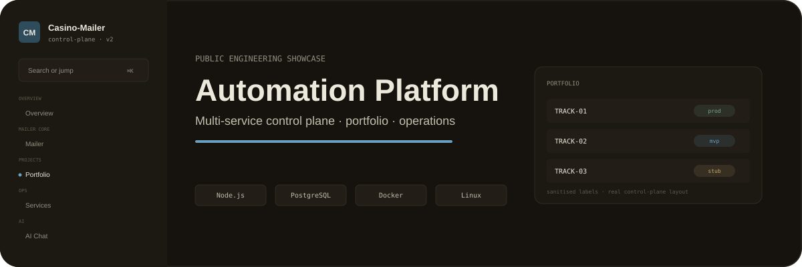

  
  
  
  
  

# Multi-service Automation Platform

A private monorepo I built as a home for **18 service/product directions**: messaging, bots, APIs, data processing, AI tooling, workers and infrastructure.

This showcase deliberately strips out the sensitive business mechanics and keeps the part I actually want to show: **how I organised many runtimes without turning the repository into spaghetti**.

## <code>01 / platform_shape</code>

<table>
<tr>
<td width="33%" valign="top">

### Product runtimes

Independent services with their own business logic and lifecycle.

</td>
<td width="33%" valign="top">

### Shared platform

Infrastructure helpers, deployment utilities, scheduler definitions and common integration clients.

</td>
<td width="33%" valign="top">

### Control plane

One admin surface for visibility and controlled operations without importing every service into one process.

</td>
</tr>
</table>

## <code>02 / architecture</code>

~~~mermaid
flowchart TB
    ADMIN[Admin / control plane]

    subgraph Services
      MSG[Messaging]
      TG[Telegram]
      DATA[Data APIs]
      AI[AI / content]
      WORKERS[Workers]
    end

    subgraph Platform
      SHARED[Shared infra libs]
      PG[(PostgreSQL)]
      SCHED[Versioned schedules]
      DEPLOY[Deploy tooling]
      OBS[Health / watchdogs]
    end

    ADMIN --> MSG
    ADMIN --> TG
    ADMIN --> DATA
    ADMIN --> AI

    MSG --> SHARED
    TG --> SHARED
    DATA --> SHARED
    AI --> SHARED

    MSG --> PG
    TG --> PG
    DATA --> PG
    AI --> PG
    WORKERS --> PG

    SCHED --> WORKERS
    DEPLOY --> Services
    OBS --- Services
~~~

## <code>03 / the_rules_that_keep_it_sane</code>

1. **A project does not import another project's business logic.**
2. Shared code is infrastructure, not a dumping ground.
3. Secrets belong to the owning runtime.
4. Scheduled work is versioned.
5. Admin is a control plane, not a god-process.
6. Runtime status is factual: inactive means inactive.
7. Repeated deployment work becomes automation.

## <code>04 / 18_directions_without_the_noise</code>

| Group | What I built around it |
|---|---|
| Messaging | send flows, scheduling, tracking, lifecycle jobs |
| Telegram | bot runtimes, session/account infrastructure, webhooks |
| Data | APIs, ingestion, sync and processing jobs |
| AI/content | gateway/tools and batch workflows |
| Infrastructure | provisioning, workers, deployment and health |
| Control plane | admin SPA, status visibility and safe commands |

## <code>05 / why_a_monorepo</code>

Not because “monorepo is cool”.

I wanted one place for:

- shared operational conventions;
- one deployment language;
- one documentation standard;
- versioned schedules;
- reusable infrastructure helpers;
- portfolio-level visibility;

while still keeping runtime/business boundaries explicit.

## <code>06 / technical_proof</code>

- [Architecture](docs/ARCHITECTURE.md)
- [Boundary rules](docs/BOUNDARIES.md)
- [Sanitised service manifest](examples/service-manifest.json)

<b>Deliberately removed from the public version</b>

Server IPs, real domains, credentials, payment mechanics, customer data, proprietary campaign logic and production runbooks.

