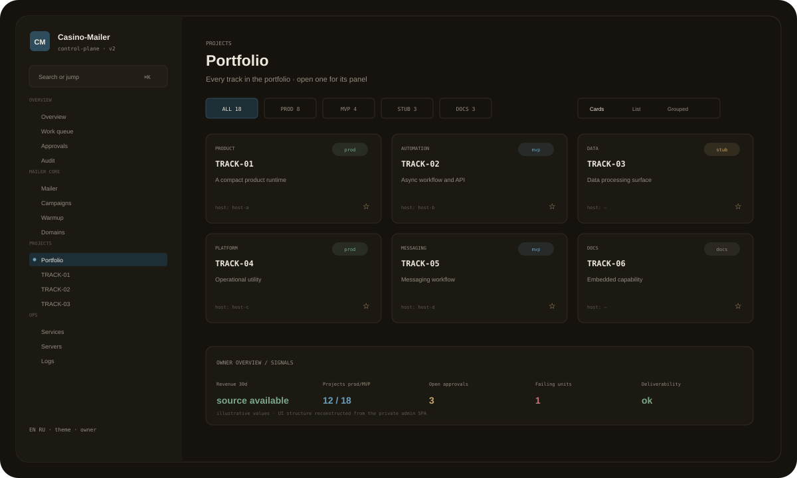
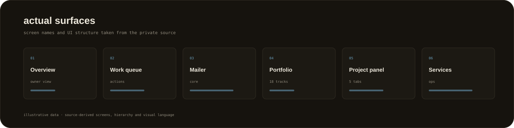
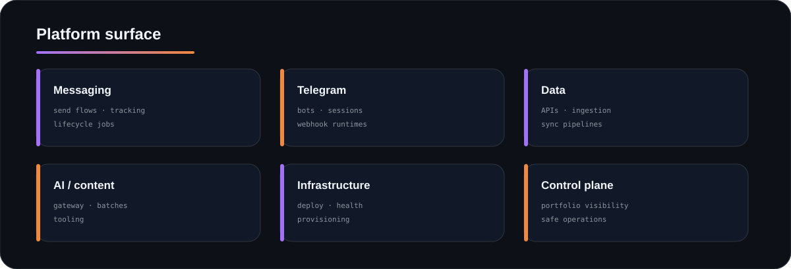
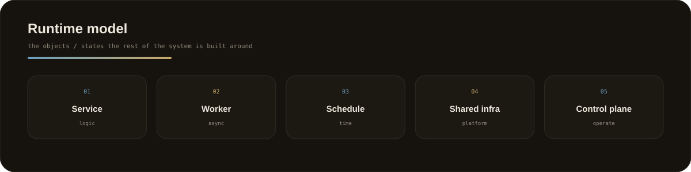
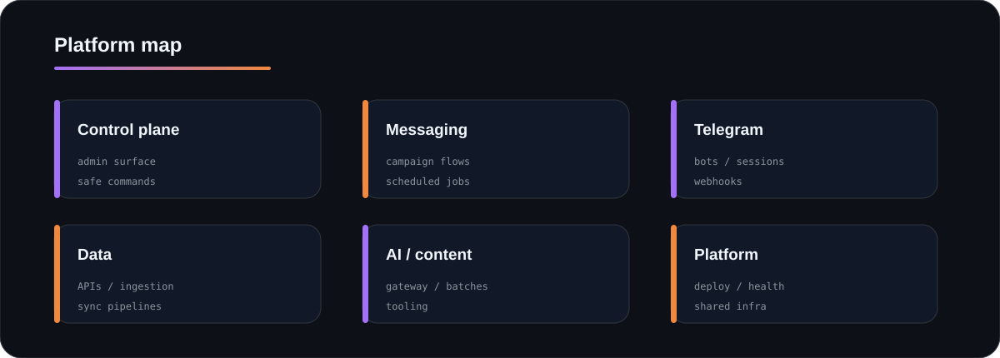
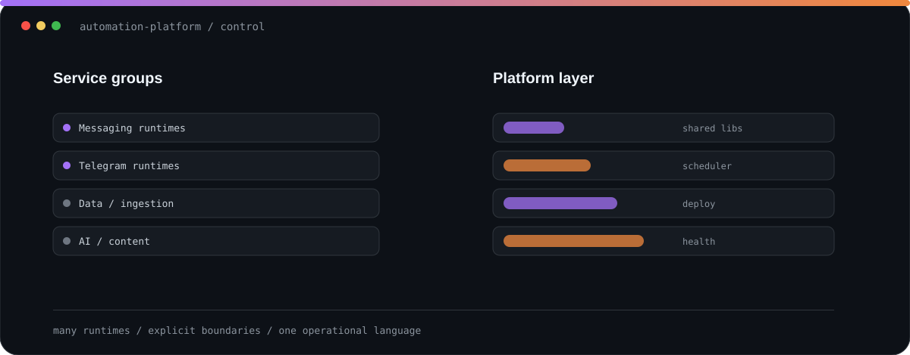
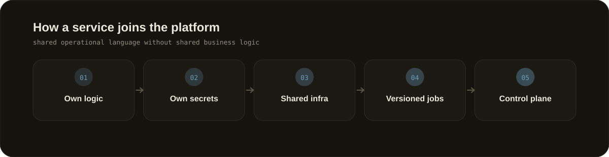
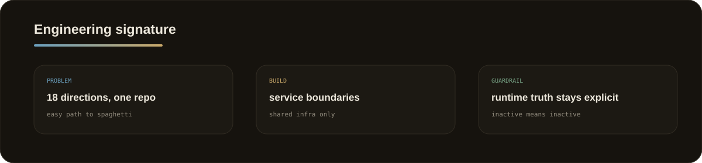

  
  
  
  
  

# Multi-service Automation Platform

A private monorepo I built as a home for **18 service/product directions**: messaging, bots, APIs, data processing, AI tooling, workers and infrastructure.

The public showcase strips out the sensitive mechanics and keeps the platform engineering.

Illustrative records; screen hierarchy, labels and visual system are reconstructed from the private source.

## <code>01 / actual_surfaces</code>

## <code>02 / platform_surface</code>

## <code>03 / core_model</code>

## <code>04 / architecture</code>

## <code>05 / service_onboarding</code>

## <code>06 / rules_that_keep_it_sane</code>

1. A project does not import another project's business logic.
2. Shared code is infrastructure, not a dumping ground.
3. Secrets belong to the owning runtime.
4. Scheduled work is versioned.
5. Admin is a control plane, not a god-process.
6. Runtime status is factual.
7. Repeated deployment work becomes automation.

## <code>07 / engineering_signature</code>

  

## <code>08 / inspect</code>

- [Architecture](docs/ARCHITECTURE.md)
- [Boundary rules](docs/BOUNDARIES.md)
- [Sanitised service manifest](examples/service-manifest.json)

<b>Deliberately not public</b>

Server IPs, real domains, credentials, payment mechanics, customer data, proprietary campaign logic and production runbooks.

