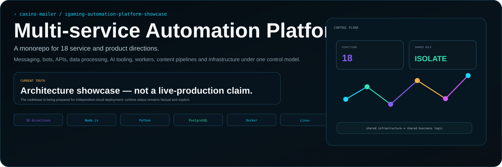
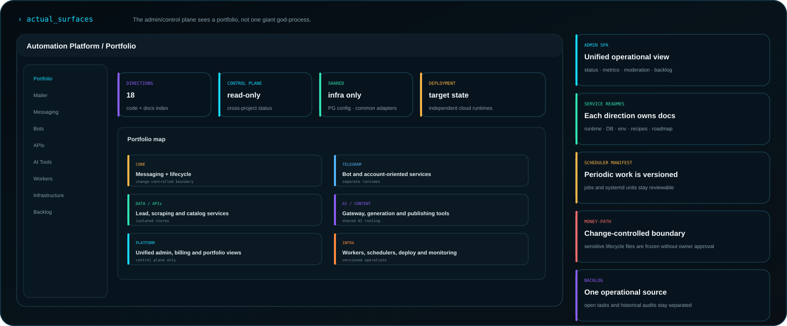
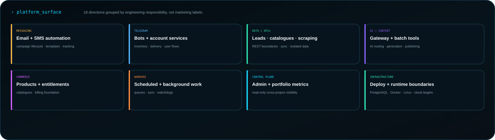
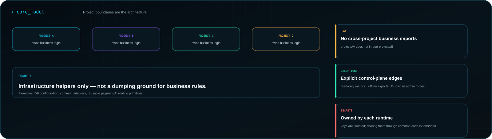
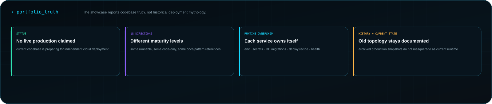
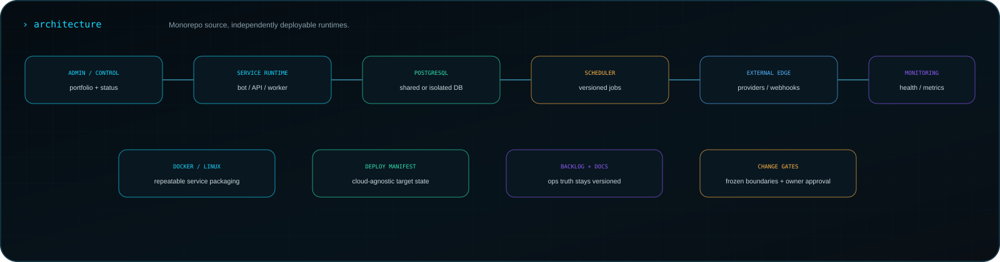
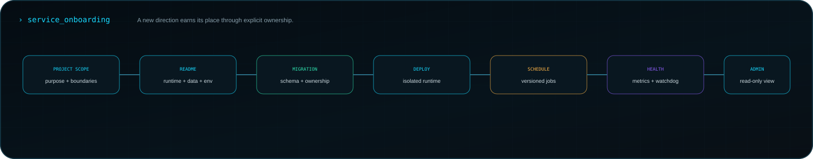
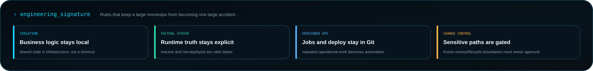

<table>
<tr>
<td width="50%" valign="top">

### What it is

A private monorepo for **18 service and product directions** across:

- messaging
- Telegram tooling
- APIs
- data processing
- AI/content tooling
- workers
- control-plane services
- deployment/infrastructure

</td>
<td width="50%" valign="top">

### The architectural rule

> **A project owns its own business logic.**

Shared code exists for infrastructure primitives, not as a shortcut for cross-project coupling.

Runtime status is also explicit: some directions are active code, some are inactive, some are patterns/docs.

</td>
</tr>
</table>

 

<table>
<tr>
<td width="52%" valign="top">

</td>
<td width="48%" valign="top">

### Portfolio, not a god-process

The control plane aggregates status and operational visibility but does not become the owner of every service.

Each direction keeps its own runtime, schema, secrets, documentation and deployment recipe.

</td>
</tr>
</table>

 

<table>
<tr>
<td width="48%" valign="top">

### Current truth

The repository is being prepared for independent cloud deployment.

Historical infrastructure remains documented as history and is not presented as current production state.

</td>
<td width="52%" valign="top">

</td>
</tr>
</table>

 

 

Private source · public engineering showcase
