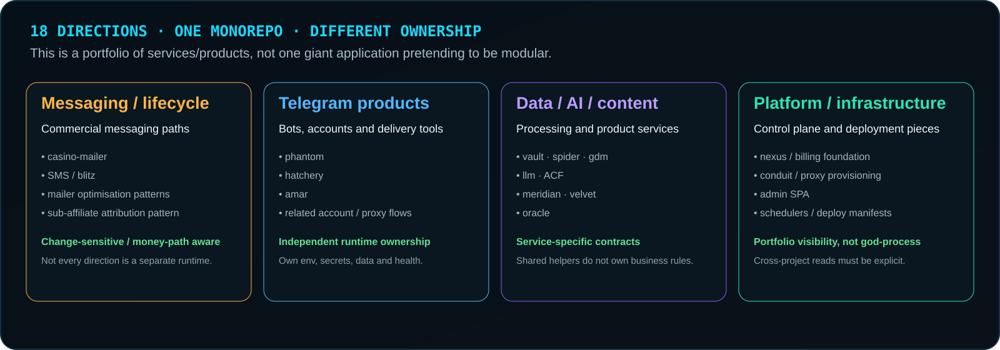
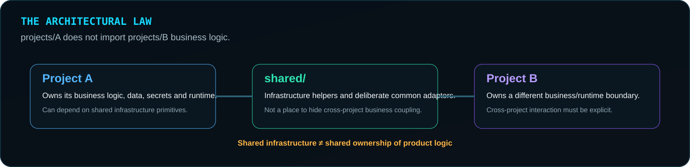

> **A monorepo portfolio containing 18 service / product directions.**  
> It is not one monolithic “iGaming automation app”. The engineering problem is keeping many different runtimes, data owners and operational paths inside one repository without letting them collapse into one god-process.

<table>
<tr>
<td align="center"><b>18 directions</b> services / products / patterns</td>
<td align="center"><b>Node + Python</b> polyglot runtimes</td>
<td align="center"><b>PostgreSQL</b> data services</td>
<td align="center"><b>Admin SPA</b> portfolio control plane</td>
<td align="center"><b>Versioned jobs</b> schedulers / deploy</td>
<td align="center"><b>No live prod claim</b> current repo truth</td>
</tr>
</table>

## Portfolio map

<table>
<tr>
<td width="33%" valign="top"><b>Not every direction is a separate server.</b> Some entries are full runtimes, some are code paths inside another runtime, and some are documentation/pattern references.</td>
<td width="33%" valign="top"><b>Status is factual.</b> The repository currently does not claim a live production topology. Historical deployment material remains history, not present-state marketing.</td>
<td width="33%" valign="top"><b>The control plane is observational.</b> Admin/portfolio views aggregate operational information but should not become the owner of every service’s business logic.</td>
</tr>
</table>

## Main rule

> **Cross-project imports are forbidden except through shared infrastructure or explicitly documented offline/read-only/control-plane exceptions.**

## How a direction becomes operational

<table>
<tr>
<td width="33%" valign="top"><b>Scope + README</b> Each direction must explain purpose, runtime, data ownership, environment and operational contract.</td>
<td width="33%" valign="top"><b>Schema + runtime</b> Migrations, secrets, schedules and deploy recipes belong to the owning service boundary.</td>
<td width="33%" valign="top"><b>Health + control plane</b> The service exposes enough operational state to be observed without giving the admin layer ownership of its internals.</td>
</tr>
</table>

## Change-sensitive paths

<table>
<tr>
<td width="50%" valign="top"><b>Money/lifecycle path</b> Critical mailer lifecycle files are explicitly frozen behind owner approval. The repository treats this as a change-control boundary, not a suggestion.</td>
<td width="50%" valign="top"><b>Versioned operations</b> Schedulers, deployment manifests and repeated operational work stay in Git so runtime behaviour can be reviewed instead of reconstructed from server folklore.</td>
</tr>
</table>

## Architecture

<table>
<tr>
<td width="33%" valign="top"><b>Independent runtime target</b> Services are being prepared to deploy independently into cloud/runtime targets rather than depending on one historical host topology.</td>
<td width="33%" valign="top"><b>Owned data / secrets</b> Each runtime owns the credentials and data paths required for its own contract.</td>
<td width="33%" valign="top"><b>Shared infrastructure only where deliberate</b> Common DB config/adapters may be shared; product-specific business rules remain local.</td>
</tr>
</table>

## Engineering signature

<b>Current-state note</b>

The source repository explicitly states that there is **no currently claimed live production fleet**. Historical server/topology documents describe prior or target states; the current engineering goal is independent cloud deployment with explicit ownership and versioned operations.

