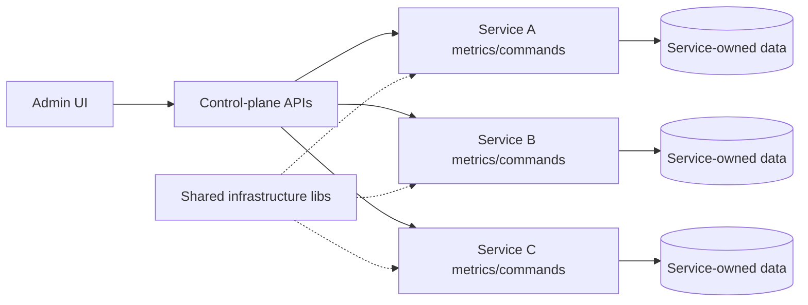

# Architecture

## Control plane vs runtimes

The platform treats the administrative UI as a **control plane**, not as a place to import every project's business code.

## Shared concerns

Safe shared modules include:

- database connection/config helpers;
- common payment/integration clients where appropriate;
- structured logging;
- deployment helpers;
- scheduler definitions;
- health/metrics contracts.

Domain decisions stay local to the owning service.

## Deployment concept

Services may share a repository while remaining independently runnable. Deployment automation maps repository components to runtime targets and keeps periodic work in versioned manifests rather than undocumented host cron state.

The public repository intentionally omits real infrastructure inventory.
